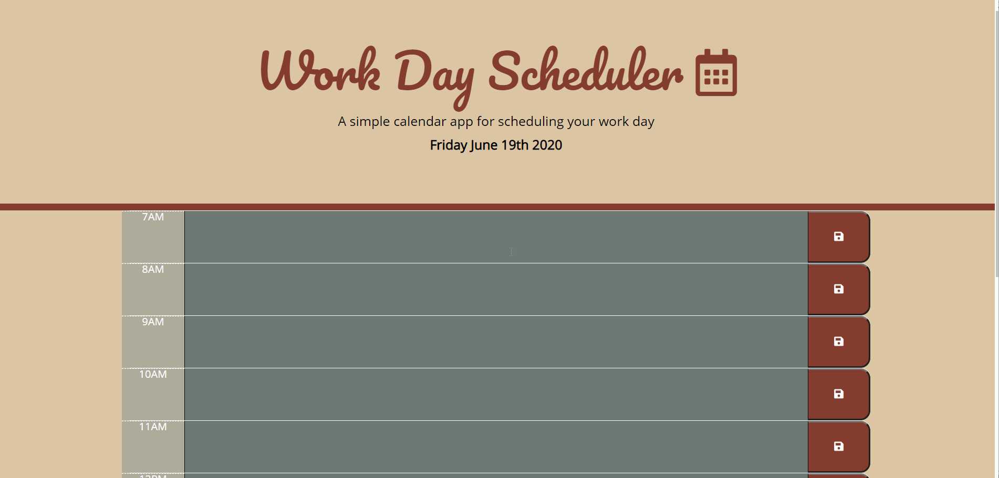

# Work Day Scheduler

### URL: https://darnocer.github.io/Third-Party-APIs-Work-Day-Scheduler/

## Description

This is a simple calendar applciation that utilizes `localStorage` to save your events and plan your work day.

## Usage

- Enter events and appointments in the time blocks
- Click the save button to save the event to `localStorage` and come back to it later

### Validation

- Events will not save if the save button is not clicked
- Hours that have already passed appear as grey
- The current hour is red
- The remaining hours in the day are greenish

## Questions?

Contact me at [darian.nocera26@gmail.com](mailto:darian.nocera26@gmail.com)

or 

#### Copyright © 2020 [Darian Nocera](http://www.github.com/darnocer)

---

##### _Created with [darnocer's README generator](https://github.com/darnocer/Node.js-and-ES6-README-Generator)_ 👽
